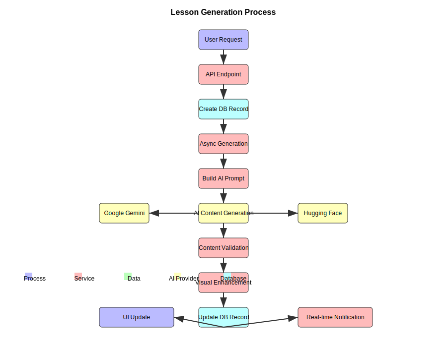
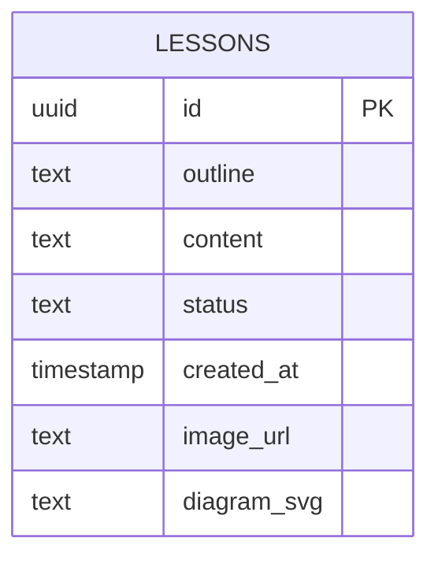
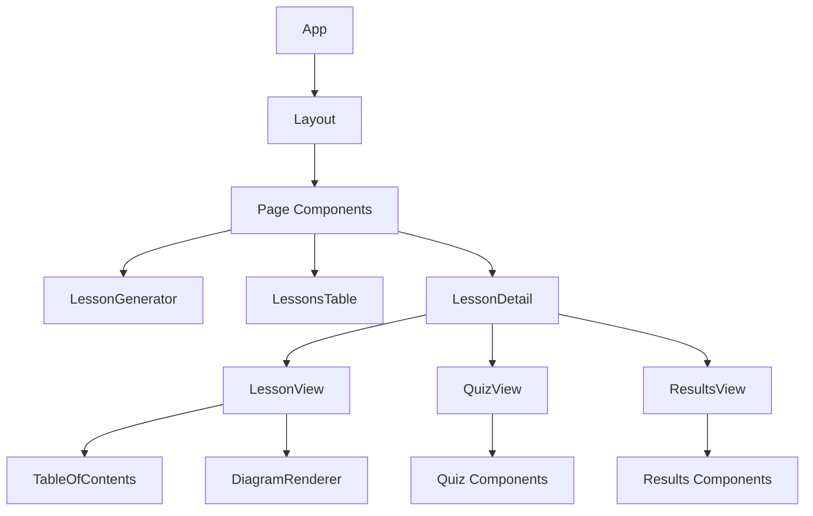
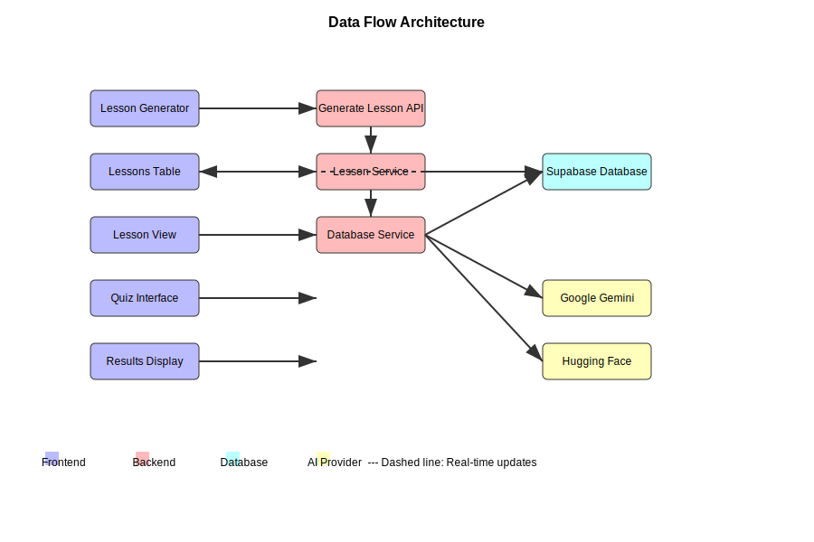
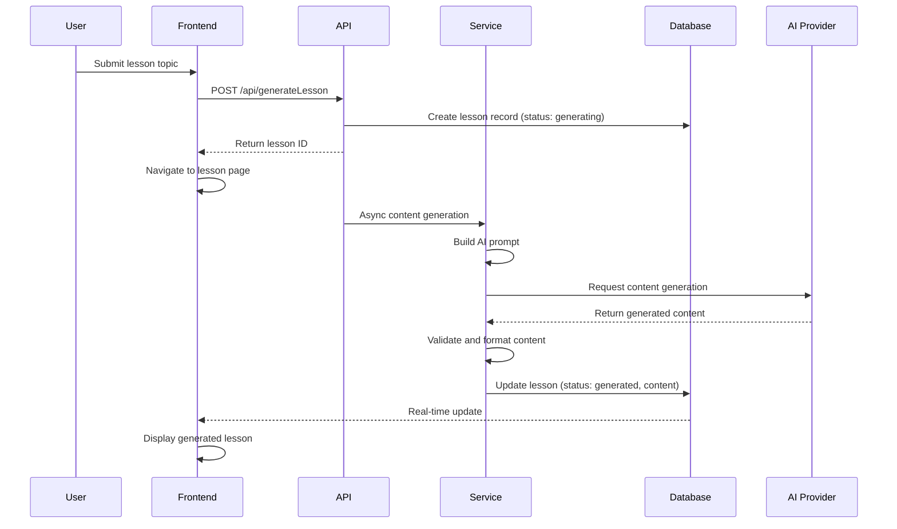
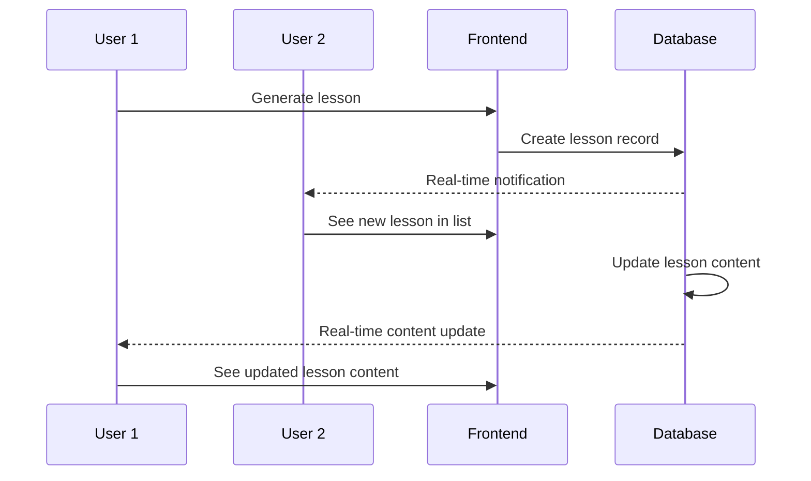

# Feyra-AI: AI-Powered Interactive Learning Platform

A modern, AI-powered learning platform that generates interactive lessons with quizzes and visual aids for enhanced educational experiences.

## Table of Contents
- [Features](#features)
- [Architecture Overview](#architecture-overview)
- [System Design](#system-design)
- [Technology Stack](#technology-stack)
- [Project Structure](#project-structure)
- [Data Flow](#data-flow)
- [UI/UX Design](#uiux-design)
- [Design Principles](#design-principles)
- [Getting Started](#getting-started)
- [Environment Variables](#environment-variables)
- [Database Schema](#database-schema)
- [API Endpoints](#api-endpoints)
- [Components](#components)
- [Services](#services)
- [Documentation](#documentation)
- [Contributing](#contributing)
- [License](#license)

## Features

- **AI-Powered Content Generation**: Create comprehensive lessons on any topic using Google Gemini
- **Interactive Quizzes**: Auto-generated multiple-choice questions with instant feedback
- **Visual Learning**: SVG diagrams and images to enhance understanding
- **Progress Tracking**: Monitor your learning progress through sections and quizzes
- **Responsive Design**: Works beautifully on all devices
- **Real-time Updates**: See lesson generation progress in real-time
- **Error Handling**: Robust error handling with retry mechanisms
- **Modular Architecture**: Extensible design for adding new features

## Architecture Overview


### Key Architectural Components

1. **Frontend Layer**: Next.js 16 with React 19 and App Router
2. **API Layer**: Serverless functions for handling requests
3. **Service Layer**: Business logic and AI integration
4. **Data Layer**: Supabase PostgreSQL with real-time capabilities
5. **AI Layer**: Multiple AI providers (Google Gemini, Hugging Face)
6. **UI Layer**: Responsive components with Tailwind CSS

## System Design

### Low-Level Design

#### 1. Lesson Generation Pipeline



#### 2. Data Model



#### 3. Component Hierarchy



## Technology Stack

### Frontend
- **Framework**: Next.js 16 with React 19
- **Styling**: Tailwind CSS with PostCSS
- **State Management**: React hooks and Supabase real-time subscriptions
- **UI Components**: Custom-built with Tailwind CSS
- **Routing**: App Router with dynamic routes

### Backend
- **API**: Next.js API routes
- **Database**: Supabase (PostgreSQL)
- **Real-time**: Supabase real-time subscriptions
- **Authentication**: Supabase Auth (if implemented)

### AI Integration
- **Primary**: Google Gemini API
- **Secondary**: Hugging Face Inference API
- **Local Option**: Ollama (for development)

### Development Tools
- **Language**: TypeScript
- **Linting**: ESLint
- **Testing**: Jest (if implemented)
- **Deployment**: Vercel

## Project Structure

```
src/
├── app/
│   ├── api/
│   │   ├── generateLesson/
│   │   │   └── route.ts
│   │   └── testEnv/
│   │       └── route.ts
│   ├── lessons/
│   │   └── [id]/
│   │       └── page.tsx
│   ├── services/
│   │   ├── buildLessonPrompt.service.ts
│   │   ├── contentGenrationService.ts
│   │   └── database.service.ts
│   ├── layout.tsx
│   └── page.tsx
├── components/
│   ├── CodeExampleRenderer.tsx
│   ├── CodeRenderer.tsx
│   ├── DiagramRenderer.tsx
│   ├── ImageRenderer.tsx
│   ├── LessonGenerator.tsx
│   ├── LessonView.tsx
│   ├── LessonsTable.tsx
│   ├── QuizView.tsx
│   ├── ResultsView.tsx
│   └── TableOfContents.tsx
├── lib/
│   ├── aiUtility.ts
│   ├── contentFormatter.ts
│   ├── supabaseClient.ts
│   ├── tracing.ts
│   └── utilityFunctions.ts
└── types/
    └── lesson.ts
```

## Data Flow



### 1. Lesson Creation Flow



### 2. Real-time Updates



## UI/UX Design

### Homepage
- Modern hero section with gradient backgrounds
- Prominent lesson generator with example topics
- Recent lessons table with visual indicators
- Feature highlights with attractive cards
- Responsive design for all devices

### Lesson View
- Course content sidebar with progress tracking
- Section completion markers
- Clean, readable content formatting
- Visual diagrams for enhanced learning
- Smooth navigation between sections

### Quiz Interface
- Timer with visual countdown
- Progress tracking
- Clear question presentation
- Visual feedback for selected answers
- Detailed results with answer explanations

### Results Page
- Color-coded pass/fail indicators
- Performance summary with statistics
- Detailed answer review with explanations
- Certificate unlock notification

## Design Principles

### Overview
The application implements a professional UI/UX design inspired by shadcn principles with a focus on:
- **Consistency**: Uniform styling across all components
- **Depth**: Subtle shadows and borders for visual hierarchy
- **Accessibility**: Proper contrast ratios and semantic HTML
- **Responsiveness**: Mobile-first approach with adaptive layouts

### Key Design Elements
- **Color Palette**: Gray-based with accent colors for actions
- **Typography**: System fonts with clear hierarchy
- **Spacing**: Consistent padding and margins using a defined scale
- **Shadows**: Subtle elevation with `shadow-[0_3px_10px_rgb(0,0,0,0.08)]`
- **Borders**: 1px solid `border-gray-200` for clear separation
- **Rounded Corners**: `rounded-xl` for modern appearance

### Component Design
- **Cards**: Elevated containers with consistent padding and borders
- **Buttons**: Clear visual hierarchy with hover states
- **Forms**: Accessible inputs with proper labeling
- **Navigation**: Intuitive sidebar and breadcrumb navigation

For detailed implementation of design principles, see [DESIGN_PRINCIPLES.md](DESIGN_PRINCIPLES.md)

## Getting Started

### Prerequisites
- Node.js >= 20.9.0
- npm, yarn, pnpm, or bun
- Supabase account
- Google Gemini API key (or Hugging Face/Ollama for alternatives)

### Installation

1. Clone the repository:
   ```bash
   git clone <repository-url>
   cd astral
   ```

2. Install dependencies:
   ```bash
   npm install
   # or
   yarn install
   # or
   pnpm install
   # or
   bun install
   ```

3. Set up environment variables (see [Environment Variables](#environment-variables))

4. Run the development server:
   ```bash
   npm run dev
   # or
   yarn dev
   # or
   pnpm dev
   # or
   bun dev
   ```

5. Open [http://localhost:3000](http://localhost:3000) in your browser

## Environment Variables

Create a `.env.local` file in the root directory with the following variables:

```env
# Supabase Configuration
NEXT_PUBLIC_SUPABASE_URL=your_supabase_project_url
NEXT_PUBLIC_SUPABASE_ANON_KEY=your_supabase_anon_key
SUPABASE_SERVICE_ROLE_KEY=your_supabase_service_role_key

# AI Provider Configuration (choose one or more)
GEMINI_API_KEY=your_google_gemini_api_key
HUGGING_FACE_TOKEN=your_hugging_face_token
OLLAMA_API_URL=http://localhost:11434 (for local Ollama)

# Observability (Optional)
LANGFUSE_API_KEY=your_langfuse_api_key
```

## Database Schema

### Lessons Table

```sql
CREATE TABLE lessons (
  id UUID DEFAULT uuid_generate_v4() PRIMARY KEY,
  outline TEXT NOT NULL,
  content TEXT,
  status TEXT CHECK (status IN ('generating', 'generated')) DEFAULT 'generating',
  created_at TIMESTAMP WITH TIME ZONE DEFAULT NOW(),
  image_url TEXT,
  diagram_svg TEXT
);
```

### Enable Real-time Updates

```sql
ALTER PUBLICATION supabase_realtime ADD TABLE lessons;
```

## API Endpoints

### Lesson Generation
- **POST** `/api/generateLesson`
  - **Request Body**: `{ "outline": "lesson topic" }`
  - **Response**: Lesson object with ID
  - **Description**: Initiates lesson generation process

### Environment Test
- **GET** `/api/testEnv`
  - **Response**: Environment status information
  - **Description**: Tests API and AI provider connectivity

## Components

### Core UI Components
- `LessonGenerator` - Main lesson creation interface with progress tracking
- `LessonsTable` - Display recent lessons with status indicators and visual tags
- `LessonView` - Render lesson content with table of contents and navigation
- `QuizView` - Interactive quiz interface with timer and progress tracking
- `ResultsView` - Quiz results with detailed feedback and performance metrics
- `DiagramRenderer` - Display SVG diagrams with copy functionality
- `TableOfContents` - Navigation sidebar for lessons with progress indicators

### Utility Components
- `CodeExampleRenderer` - Display interactive code examples with show/hide functionality
- `CodeRenderer` - Syntax-highlighted code display
- `ImageRenderer` - Responsive image display with lazy loading
- `Quiz Components` - Individual quiz question and answer components

## Services

### Content Generation Service
Located in `src/app/services/contentGenrationService.ts`
- Handles asynchronous lesson content generation
- Implements retry mechanisms for reliability
- Validates and formats AI-generated content
- Manages visual content enrichment

### Database Service
Located in `src/app/services/database.service.ts`
- Manages lesson record creation and updates
- Handles content serialization and deserialization
- Implements error handling for database operations

### Prompt Building Service
Located in `src/app/services/buildLessonPrompt.service.ts`
- Constructs prompts for AI content generation
- Formats lesson structure and requirements
- Ensures consistent output format

### AI Utility Functions
Located in `src/lib/aiUtility.ts`
- Google Gemini integration
- Hugging Face image/diagram generation
- Error handling and retry logic for AI calls

## Documentation

For more detailed technical documentation, please refer to the following files:

### System Design Documents
- [`docs/SYSTEM_DESIGN.md`](docs/SYSTEM_DESIGN.md) - Comprehensive system architecture with diagrams
  - System architecture diagrams
  - Low-level design specifications
  - Data flow diagrams
  - Entity relationship diagrams
  - Component architecture
  - Sequence diagrams
  - State diagrams
  - Deployment architecture

### Content Structure
- [`docs/CONTENT_STRUCTURE.md`](docs/CONTENT_STRUCTURE.md) - Detailed lesson content structure
  - Lesson data model
  - Content hierarchy
  - JSON structure examples
  - Visual components
  - Quiz structure

### Observability
- [`docs/OBSERVABILITY.md`](docs/OBSERVABILITY.md) - Tracing and monitoring implementation
  - Tracing architecture
  - Langfuse integration
  - Trace structure
  - Observability flow
  - Monitoring dashboard

## Contributing

1. Fork the repository
2. Create a feature branch (`git checkout -b feature/AmazingFeature`)
3. Commit your changes (`git commit -m 'Add some AmazingFeature'`)
4. Push to the branch (`git push origin feature/AmazingFeature`)
5. Open a pull request

## License

This project is licensed under the MIT License - see the [LICENSE](LICENSE) file for details.

## Acknowledgments

- Google Gemini for AI content generation
- Supabase for backend and real-time functionality
- Tailwind CSS for styling
- Hugging Face for image generation capabilities
- Langfuse for observability and tracing