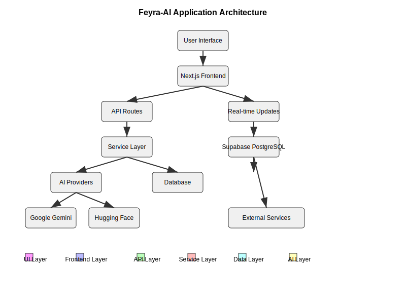

# Feyra-AI: AI-Powered Interactive Learning Platform

A modern, AI-powered learning platform that generates interactive lessons with quizzes and visual aids for enhanced educational experiences.

## Table of Contents
- [Features](#features)
- [Architecture Overview](#architecture-overview)
- [Technology Stack](#technology-stack)
- [Project Structure](#project-structure)
- [Getting Started](#getting-started)
- [Environment Variables](#environment-variables)
- [Database Schema](#database-schema)
- [API Endpoints](#api-endpoints)
- [Deployment](#deployment)
- [Production Considerations](#production-considerations)
- [Monitoring & Observability](#monitoring--observability)
- [Contributing](#contributing)
- [License](#license)

## Features

- **AI-Powered Content Generation**: Create comprehensive lessons on any topic using Google Gemini
- **Interactive Quizzes**: Auto-generated multiple-choice questions with instant feedback
- **Visual Learning**: SVG diagrams and images to enhance understanding
- **Progress Tracking**: Monitor your learning progress through sections and quizzes
- **Responsive Design**: Works beautifully on all devices
- **Real-time Updates**: See lesson generation progress in real-time
- **Error Handling**: Robust error handling with retry mechanisms
- **Modular Architecture**: Extensible design for adding new features

## Architecture Overview



### Key Architectural Components

1. **Frontend Layer**: Next.js 16 with React 19 and App Router
2. **API Layer**: Serverless functions for handling requests
3. **Service Layer**: Business logic and AI integration
4. **Data Layer**: Supabase PostgreSQL with real-time capabilities
5. **AI Layer**: Multiple AI providers (Google Gemini, Hugging Face)
6. **UI Layer**: Responsive components with Tailwind CSS

## Technology Stack

### Frontend
- **Framework**: Next.js 16 with React 19
- **Styling**: Tailwind CSS with PostCSS
- **State Management**: React hooks and Supabase real-time subscriptions
- **UI Components**: Custom-built with Tailwind CSS
- **Routing**: App Router with dynamic routes

### Backend
- **API**: Next.js API routes
- **Database**: Supabase (PostgreSQL)
- **Real-time**: Supabase real-time subscriptions
- **Authentication**: Supabase Auth (if implemented)

### AI Integration
- **Primary**: Google Gemini API
- **Secondary**: Hugging Face Inference API
- **Local Option**: Ollama (for development)

### Development Tools
- **Language**: TypeScript
- **Linting**: ESLint
- **Testing**: Jest (if implemented)
- **Deployment**: Vercel

## Project Structure

```
src/
├── app/
│   ├── api/ - API routes (generateLesson, testEnv)
│   ├── lessons/[id]/ - Dynamic lesson pages
│   └── services/ - Business logic (content generation, DB, prompts)
├── components/ - Reusable UI components (LessonView, QuizView, etc.)
├── lib/ - Utilities (AI, Supabase client, formatting)
└── types/ - Type definitions (lesson.ts)
```
Root files include config (next.config.ts, tsconfig.json), package management (package.json), and documentation.

## Getting Started

### Prerequisites
- Node.js >= 20.9.0
- npm, yarn, pnpm, or bun
- Supabase account
- Google Gemini API key (or Hugging Face/Ollama for alternatives)

### Installation

1. Clone the repository:
   ```bash
   git clone <repository-url>
   cd feyra-ai
   ```

2. Install dependencies:
   ```bash
   npm install
   # or
   yarn install
   # or
   pnpm install
   # or
   bun install
   ```

3. Set up environment variables (see [Environment Variables](#environment-variables))

4. Run the development server:
   ```bash
   npm run dev
   # or
   yarn dev
   # or
   pnpm dev
   # or
   bun dev
   ```

5. Open [http://localhost:3000](http://localhost:3000) in your browser

### Building for Production

```bash
npm run build
# or
yarn build
# or
pnpm build
# or
bun build
```

### Running Production Build

```bash
npm start
# or
yarn start
# or
pnpm start
# or
bun start
```

## Environment Variables

Create a `.env.local` file in the root directory based on the `.env.local.example` file:

```env
# Supabase Configuration
NEXT_PUBLIC_SUPABASE_URL=your_supabase_project_url
NEXT_PUBLIC_SUPABASE_ANON_KEY=your_supabase_anon_key
SUPABASE_SERVICE_ROLE_KEY=your_supabase_service_role_key

# AI Provider Configuration (choose one or more)
GEMINI_API_KEY=your_google_gemini_api_key
HUGGING_FACE_TOKEN=your_hugging_face_token
OLLAMA_API_URL=http://localhost:11434

# Observability (Optional)
LANGFUSE_PUBLIC_KEY=your_langfuse_public_key
LANGFUSE_SECRET_KEY=your_langfuse_secret_key
LANGFUSE_HOST=https://cloud.langfuse.com

# Edge Config (Optional for Vercel)
EDGE_CONFIG=your_edge_config_url
```

### Environment Variable Details

- **NEXT_PUBLIC_SUPABASE_URL**: Your Supabase project URL
- **NEXT_PUBLIC_SUPABASE_ANON_KEY**: Your Supabase anonymous key
- **SUPABASE_SERVICE_ROLE_KEY**: Your Supabase service role key (keep secret)
- **GEMINI_API_KEY**: Google Gemini API key for content generation
- **HUGGING_FACE_TOKEN**: Hugging Face API token for image generation
- **OLLAMA_API_URL**: Local Ollama API URL (default: http://localhost:11434)
- **LANGFUSE_PUBLIC_KEY**: Langfuse public key for observability
- **LANGFUSE_SECRET_KEY**: Langfuse secret key for observability
- **LANGFUSE_HOST**: Langfuse host URL (default: https://cloud.langfuse.com)

## Database Schema

### Lessons Table

```sql
CREATE TABLE lessons (
  id UUID DEFAULT uuid_generate_v4() PRIMARY KEY,
  outline TEXT NOT NULL,
  content TEXT,
  json_content JSONB,
  status TEXT CHECK (status IN ('generating', 'generated', 'error')) DEFAULT 'generating',
  error_message TEXT,
  created_at TIMESTAMP WITH TIME ZONE DEFAULT NOW(),
  image_url TEXT,
  diagram_svg TEXT,
  progress INTEGER DEFAULT 0,
  raw_content TEXT
);
```

### Enable Real-time Updates

```sql
ALTER PUBLICATION supabase_realtime ADD TABLE lessons;
```

## API Endpoints

### Lesson Generation
- **POST** `/api/generateLesson`
  - **Request Body**: `{ "outline": "lesson topic" }`
  - **Response**: Lesson object with ID
  - **Description**: Initiates lesson generation process

### Lesson Content Generation (Async)
- **POST** `/api/generateLessonContent`
  - **Request Body**: `{ "lessonId": "uuid", "outline": "lesson topic" }`
  - **Response**: `{ "message": "Content generation started" }`
  - **Description**: Starts async content generation for a lesson

### Lesson Status
- **GET** `/api/lessonStatus?lessonId=uuid`
  - **Response**: `{ "id": "uuid", "status": "generating|generated|error", "progress": number }`
  - **Description**: Get the current status and progress of a lesson

### Process Queue
- **POST** `/api/processQueue`
  - **Request Body**: `{ "lessonId": "uuid", "step": "generateContent|parseAndSaveContent|generateVisuals|finalize" }`
  - **Response**: `{ "success": true }`
  - **Description**: Process a specific step in the lesson generation pipeline

### Environment Test
- **GET** `/api/testEnv`
  - **Response**: Environment status information
  - **Description**: Tests API and AI provider connectivity

### Edge Config Test
- **GET** `/api/edgeConfig`
  - **Response**: Edge config status
  - **Description**: Tests Vercel Edge Config connectivity

## Deployment

### Vercel Deployment (Recommended)

1. Push your code to a GitHub repository
2. Connect the repository to Vercel
3. Set environment variables in Vercel dashboard
4. Deploy!

### Manual Deployment

1. Build the application:
   ```bash
   npm run build
   ```

2. Start the production server:
   ```bash
   npm start
   ```

### Docker Deployment (Optional)

Create a Dockerfile:
```dockerfile
FROM node:20-alpine AS deps
WORKDIR /app
COPY package.json package-lock.json ./
RUN npm ci

FROM node:20-alpine AS builder
WORKDIR /app
COPY --from=deps /app/node_modules ./node_modules
COPY . .
RUN npm run build

FROM node:20-alpine AS runner
WORKDIR /app
ENV NODE_ENV production
RUN addgroup --gid 1001 --system nodejs
RUN adduser --uid 1001 --system nodejs
COPY --from=builder /app/public ./public
COPY --from=builder /app/.next/standalone ./
COPY --from=builder /app/.next/static ./.next/static
USER nodejs
EXPOSE 3000
CMD ["node", "server.js"]
```

## Production Considerations

### Performance Optimization

1. **Caching**: Implement Redis or similar caching solution for frequently accessed data
2. **CDN**: Use a CDN for static assets
3. **Image Optimization**: Use Next.js Image component for automatic optimization
4. **Code Splitting**: Leverage Next.js automatic code splitting
5. **Database Indexes**: Add appropriate indexes to Supabase tables

### Security

1. **Rate Limiting**: Implement rate limiting for API endpoints
2. **Input Validation**: Validate all user inputs
3. **Environment Variables**: Keep secrets secure and never commit them
4. **CORS**: Configure CORS properly
5. **Authentication**: Implement proper user authentication if needed

### Error Handling

1. **Logging**: Implement comprehensive logging
2. **Monitoring**: Set up error tracking (e.g., Sentry)
3. **Fallbacks**: Implement fallback mechanisms for AI services
4. **Retry Logic**: Use exponential backoff for failed requests

### Scalability

1. **Database**: Monitor Supabase performance and upgrade as needed
2. **API**: Consider API gateway for traffic management
3. **AI Services**: Monitor rate limits and implement queuing if needed
4. **Caching**: Use Redis or similar for frequently accessed data

## Monitoring & Observability

### Langfuse Integration

The application includes Langfuse integration for tracing AI operations:

1. Set up Langfuse account
2. Configure environment variables
3. Traces will automatically be sent to Langfuse

### Supabase Monitoring

1. Use Supabase dashboard for database monitoring
2. Set up alerts for performance issues
3. Monitor real-time subscriptions

### Error Tracking

Consider integrating error tracking solutions like:
- Sentry
- LogRocket
- Rollbar

## Contributing

1. Fork the repository
2. Create a feature branch (`git checkout -b feature/AmazingFeature`)
3. Commit your changes (`git commit -m 'Add some AmazingFeature'`)
4. Push to the branch (`git push origin feature/AmazingFeature`)
5. Open a pull request

## License

This project is licensed under the MIT License - see the [LICENSE](LICENSE) file for details.

## Acknowledgments

- Google Gemini for AI content generation
- Supabase for backend and real-time functionality
- Tailwind CSS for styling
- Hugging Face for image generation capabilities
- Langfuse for observability and tracing