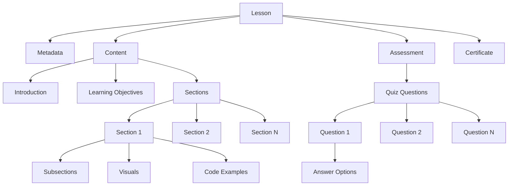
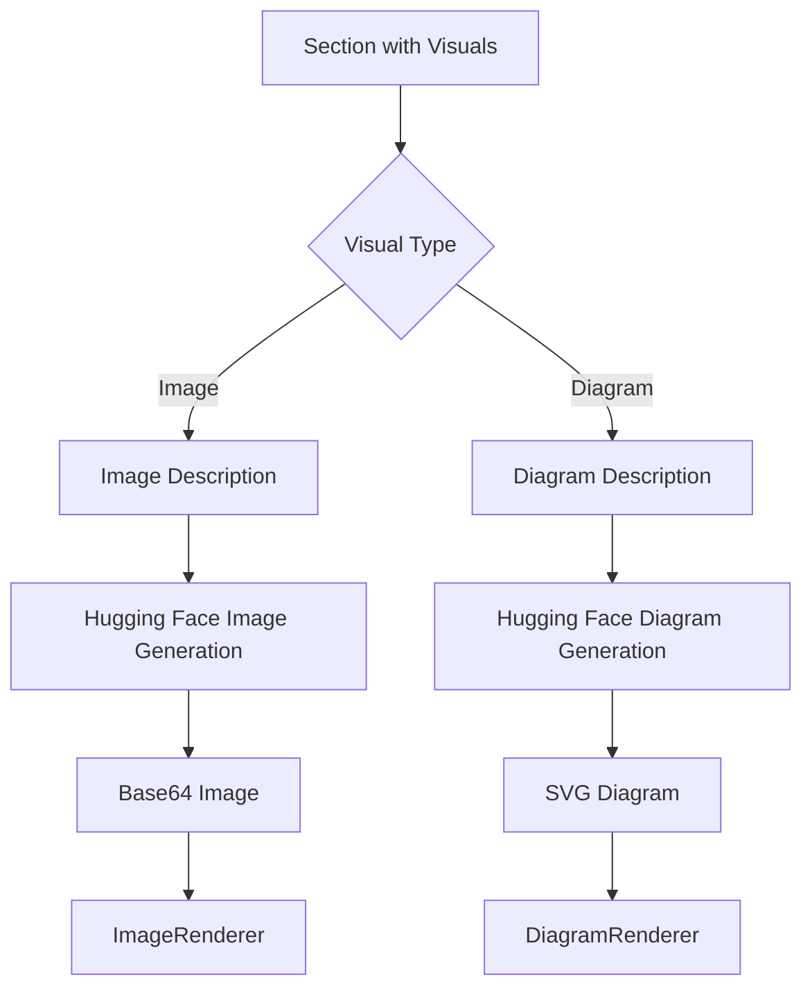
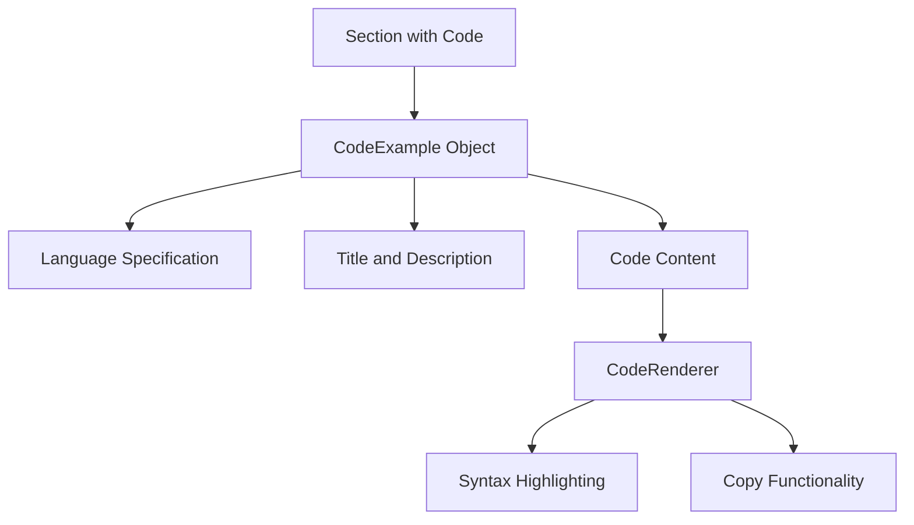
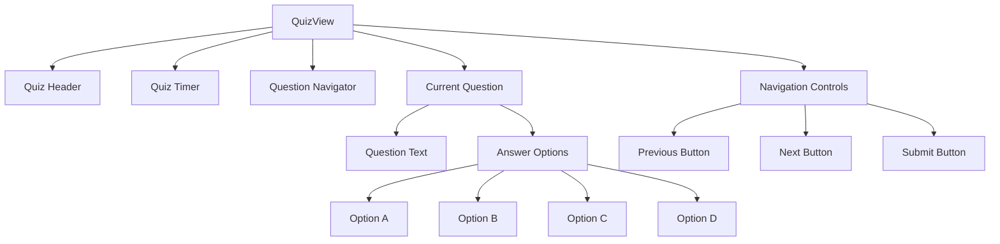
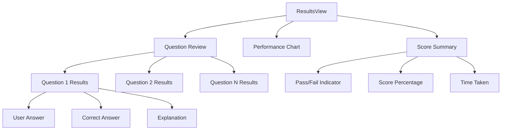

# Feyra-AI Lesson Content Structure

## Table of Contents
- [Lesson Data Model](#lesson-data-model)
- [Content Hierarchy](#content-hierarchy)
- [JSON Structure](#json-structure)
- [Visual Components](#visual-components)
- [Quiz Structure](#quiz-structure)

## Lesson Data Model



## Content Hierarchy

### 1. Root Level
```json
{
  "id": 1,
  "type": "lesson",
  "metadata": {},
  "content": {},
  "assessment": {},
  "certificate": {}
}
```

### 2. Metadata Structure
```json
{
  "title": "Lesson Title",
  "description": "Brief description",
  "category": "Subject Category",
  "difficulty": "Beginner/Intermediate/Advanced",
  "estimatedTime": 30,
  "tags": ["tag1", "tag2"],
  "author": "AI Generated",
  "createdAt": "ISO Date",
  "generatedBy": "Gemini/HuggingFace"
}
```

### 3. Content Structure
```json
{
  "introduction": "Lesson introduction text",
  "learningObjectives": [
    "Objective 1",
    "Objective 2",
    "Objective 3"
  ],
  "sections": []
}
```

### 4. Section Structure
```json
{
  "id": 1,
  "title": "Section Title",
  "content": "Section content text",
  "type": "theory/practice/example",
  "order": 1,
  "visuals": {
    "description": "Visual description",
    "type": "image/diagram/code"
  },
  "codeExample": {
    "language": "javascript/python/etc",
    "title": "Example Title",
    "description": "Example description",
    "code": "Code content"
  },
  "subsections": []
}
```

## JSON Structure

### Complete Lesson JSON Example
```json
{
  "id": 1,
  "type": "lesson",
  "metadata": {
    "title": "Introduction to JavaScript",
    "description": "Learn the basics of JavaScript programming",
    "category": "Programming",
    "difficulty": "Beginner",
    "estimatedTime": 45,
    "tags": ["javascript", "programming", "web development"],
    "author": "AI Generated",
    "createdAt": "2025-10-24T10:00:00Z",
    "generatedBy": "Gemini"
  },
  "content": {
    "introduction": "JavaScript is a versatile programming language...",
    "learningObjectives": [
      "Understand JavaScript syntax",
      "Learn about variables and data types",
      "Create your first JavaScript program"
    ],
    "sections": [
      {
        "id": 1,
        "title": "What is JavaScript?",
        "content": "JavaScript is a programming language...",
        "type": "theory",
        "order": 1,
        "visuals": {
          "description": "JavaScript logo and code example",
          "type": "image"
        }
      },
      {
        "id": 2,
        "title": "Variables and Data Types",
        "content": "In JavaScript, variables are used to store...",
        "type": "theory",
        "order": 2,
        "codeExample": {
          "language": "javascript",
          "title": "Variable Declaration",
          "description": "Example of declaring variables in JavaScript",
          "code": "let name = 'John';\nconst age = 25;\nvar isActive = true;"
        }
      }
    ]
  },
  "assessment": {
    "id": 1,
    "type": "quiz",
    "passingScore": 70,
    "totalQuestions": 5,
    "timeLimit": 10,
    "instructions": [
      "Select the best answer for each question",
      "You have 10 minutes to complete the quiz"
    ],
    "questions": [
      {
        "id": 1,
        "question": "Which keyword is used to declare a variable in JavaScript?",
        "options": [
          {
            "id": "a",
            "text": "var",
            "isCorrect": false
          },
          {
            "id": "b",
            "text": "let",
            "isCorrect": false
          },
          {
            "id": "c",
            "text": "const",
            "isCorrect": false
          },
          {
            "id": "d",
            "text": "All of the above",
            "isCorrect": true
          }
        ],
        "explanation": "In modern JavaScript, you can declare variables using var, let, or const.",
        "difficulty": "Beginner"
      }
    ]
  },
  "certificate": {
    "enabled": true,
    "criteria": {
      "minScore": 70
    }
  }
}
```

## Visual Components

### Diagram Generation Flow



### Code Example Structure



## Quiz Structure

### Quiz Component Hierarchy



### Results View Structure



This documentation provides a comprehensive view of the lesson content structure used in the Feyra-AI platform, including detailed JSON examples and visual component hierarchies.