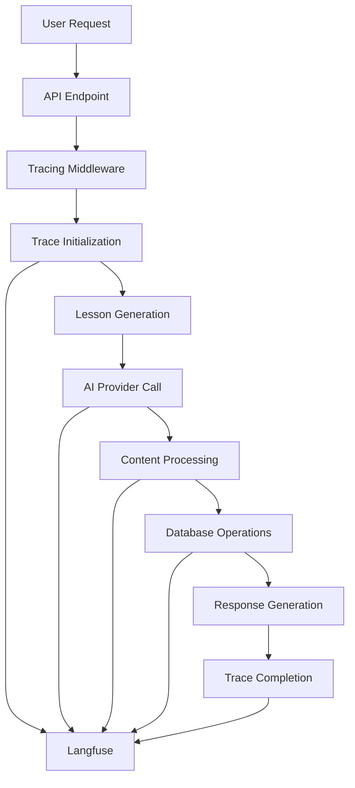
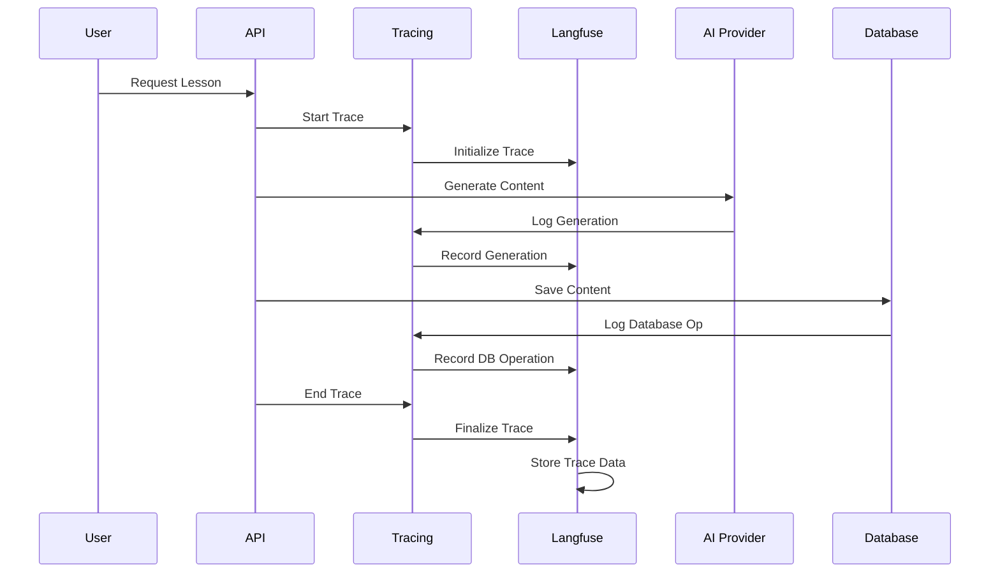
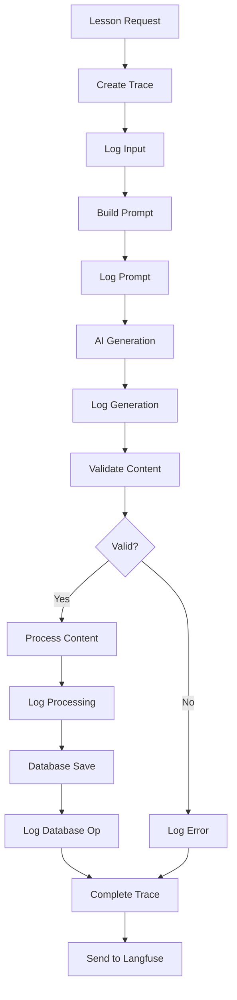
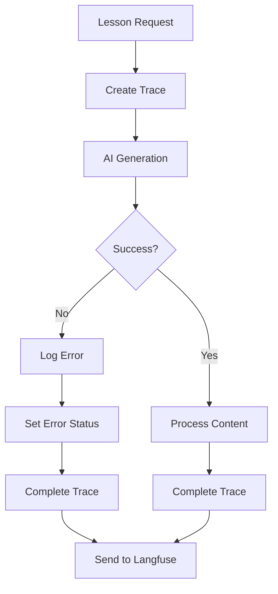
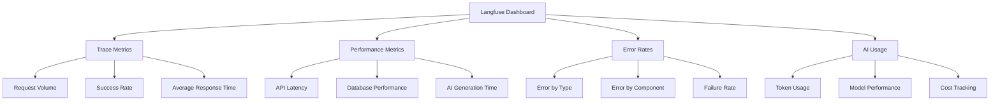
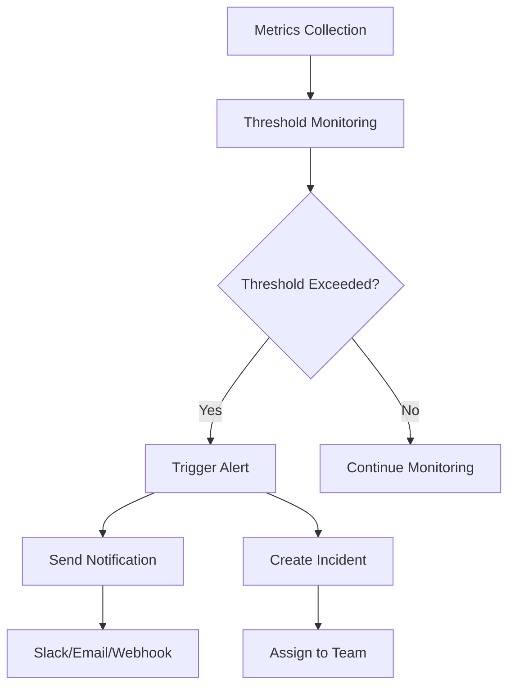

# Feyra-AI Observability and Tracing

## Table of Contents
- [Tracing Architecture](#tracing-architecture)
- [Langfuse Integration](#langfuse-integration)
- [Trace Structure](#trace-structure)
- [Observability Flow](#observability-flow)
- [Monitoring Dashboard](#monitoring-dashboard)

## Tracing Architecture



## Langfuse Integration

### Tracing Flow



## Trace Structure

Based on the sample trace in `traces/sample.json`, here's the structure used for observability:

### Root Trace Object
```json
{
  "traceId": "unique-trace-id",
  "name": "lesson-generation",
  "startTime": "ISO Timestamp",
  "endTime": "ISO Timestamp",
  "status": "SUCCESS/ERROR",
  "input": {
    "outline": "Lesson topic"
  },
  "output": {
    "lessonId": "generated-lesson-id",
    "content": "generated-content"
  },
  "observations": []
}
```

### Generation Observation
```json
{
  "id": "generation-observation-id",
  "type": "GENERATION",
  "name": "ai-generation",
  "startTime": "ISO Timestamp",
  "endTime": "ISO Timestamp",
  "model": "gemini-2.0-flash-001",
  "input": "prompt-text",
  "output": "generated-content",
  "usage": {
    "promptTokens": 85,
    "completionTokens": 245,
    "totalTokens": 330
  }
}
```

## Observability Flow

### Complete Tracing Pipeline



### Error Handling Tracing



## Monitoring Dashboard

### Key Metrics Tracked



### Alerting System



This observability documentation shows how tracing is implemented in the Feyra-AI platform using Langfuse, providing visibility into the AI generation process, performance metrics, and error tracking.