# Feyra-AI System Design Documentation

## Table of Contents
- [System Architecture](#system-architecture)
- [Low-Level Design](#low-level-design)
- [Data Flow Diagrams](#data-flow-diagrams)
- [Entity Relationship Diagram](#entity-relationship-diagram)
- [Component Architecture](#component-architecture)
- [Sequence Diagrams](#sequence-diagrams)
- [State Diagrams](#state-diagrams)
- [Deployment Architecture](#deployment-architecture)

## System Architecture

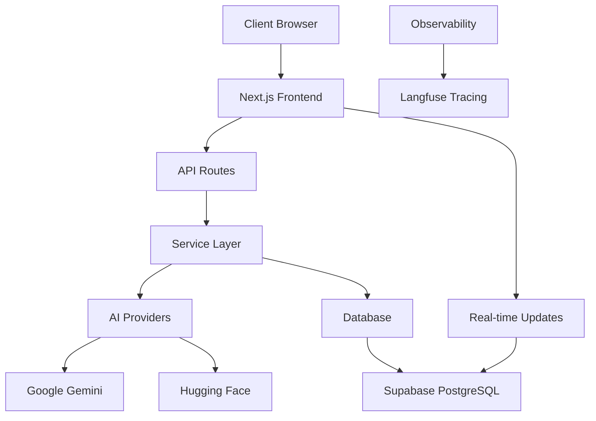

### Architecture Layers

1. **Presentation Layer**: React components with Tailwind CSS
2. **Application Layer**: Next.js API routes and server components
3. **Service Layer**: Business logic and AI integration services
4. **Data Layer**: Supabase PostgreSQL with real-time capabilities
5. **AI Layer**: Multiple AI providers (Google Gemini, Hugging Face)
6. **Observability Layer**: Langfuse for tracing and monitoring

## Low-Level Design

### 1. Lesson Generation Pipeline

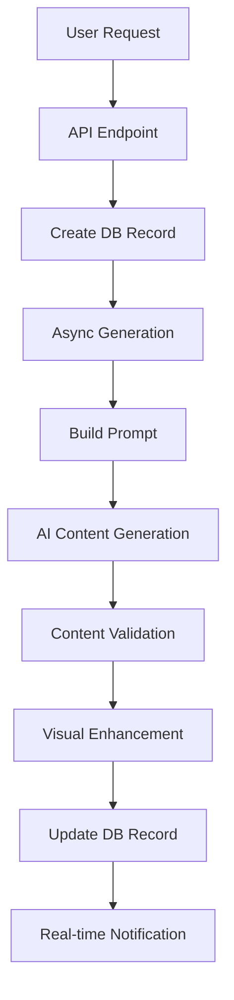

### 2. Content Generation Service Flow

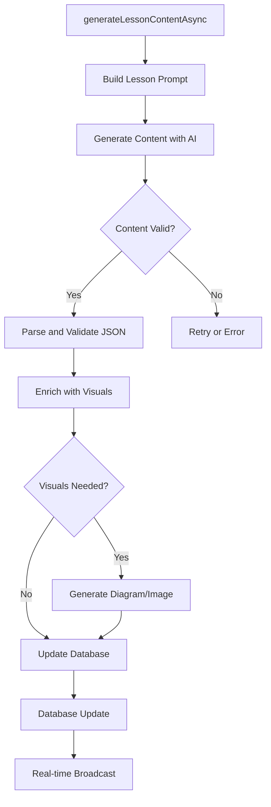

### 3. AI Provider Integration

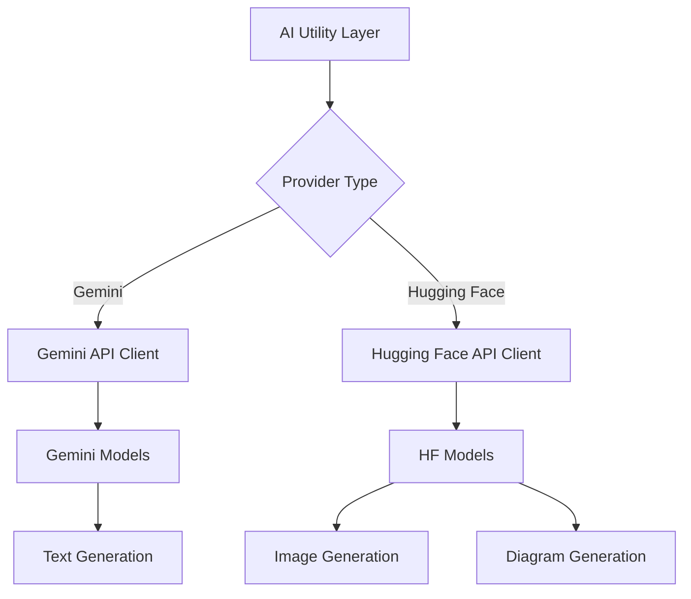

## Data Flow Diagrams

### Level 1 DFD: Main System Flow

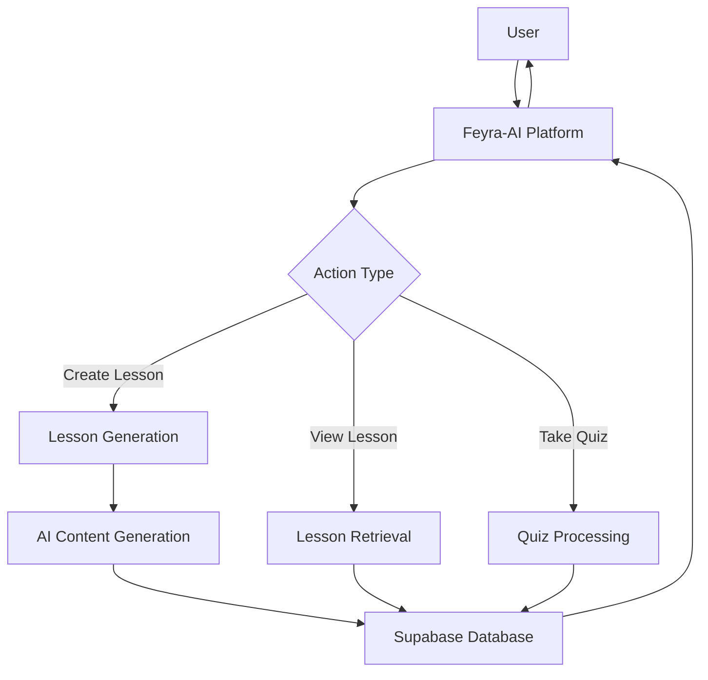

### Level 2 DFD: Lesson Generation Process

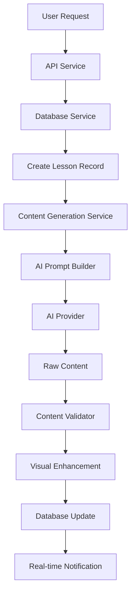

## Entity Relationship Diagram

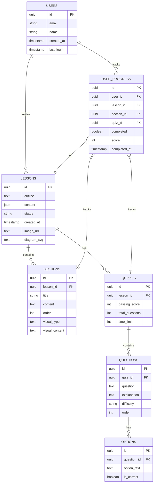

## Component Architecture

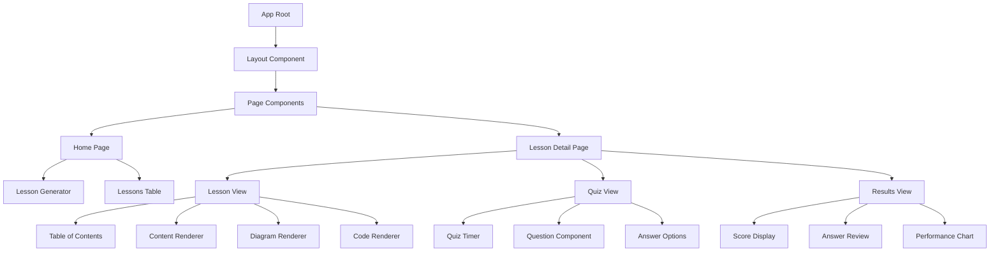

### Component Interaction Flow

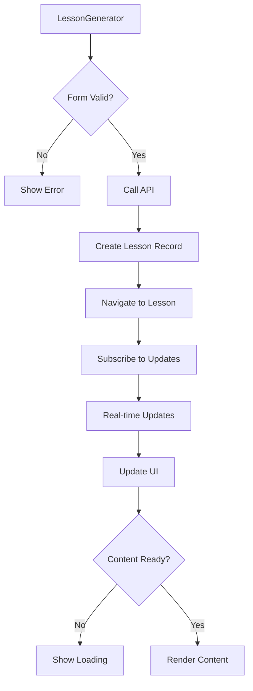

## Sequence Diagrams

### Lesson Creation Sequence

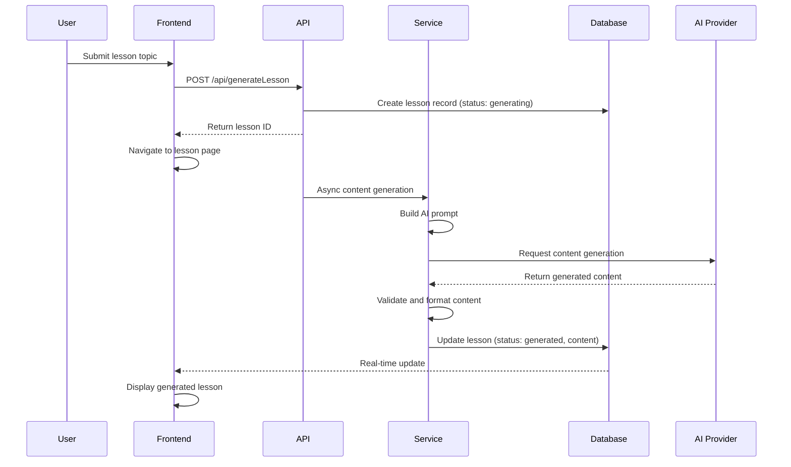

### Quiz Taking Sequence

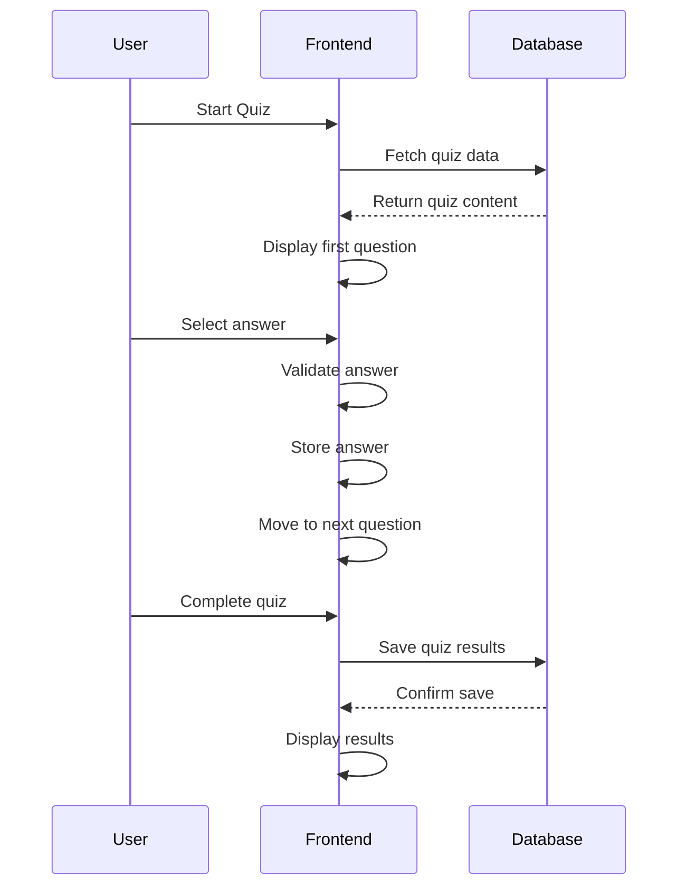

### Real-time Updates Sequence

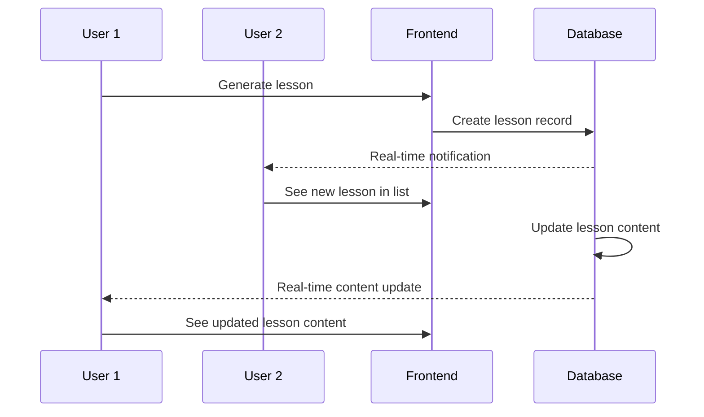

## State Diagrams

### Lesson State Machine

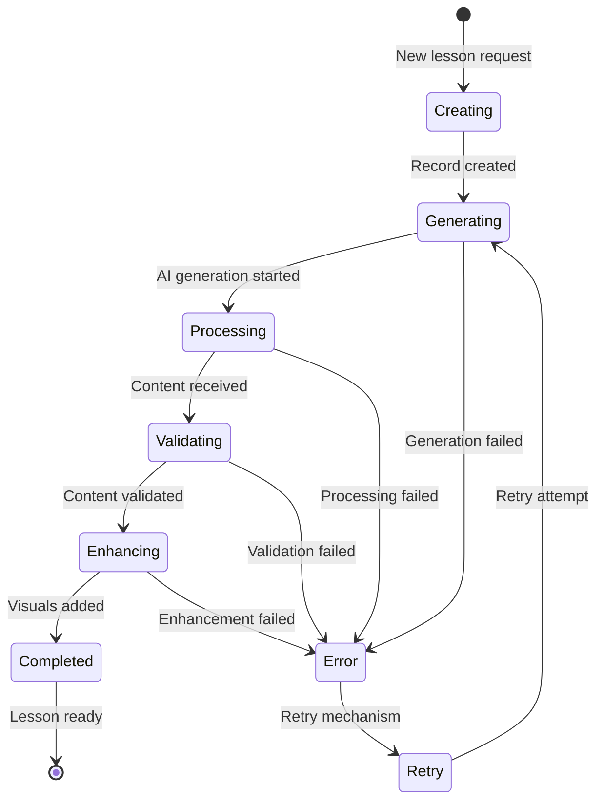

### Quiz State Machine

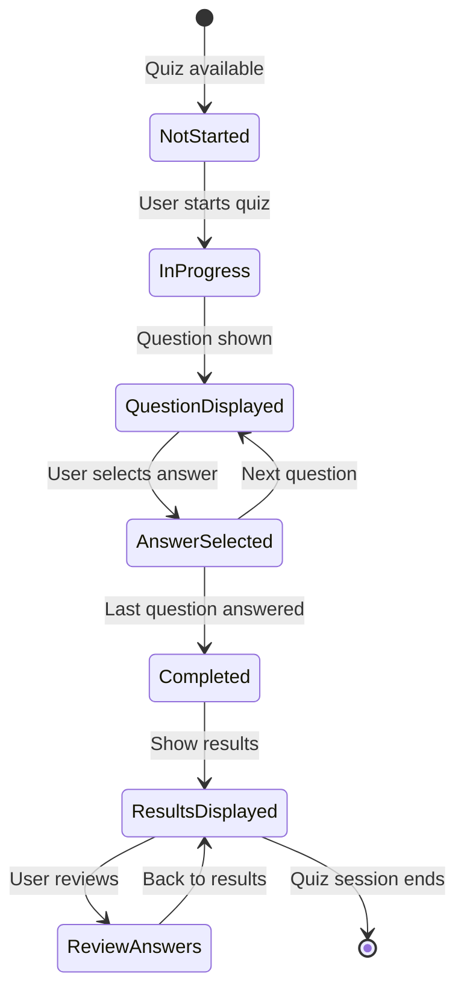

### User Session State Machine

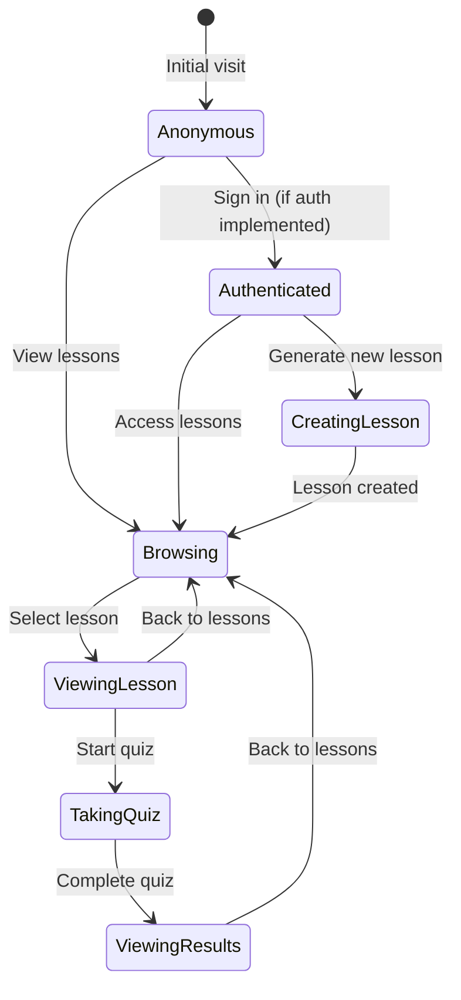

## Deployment Architecture

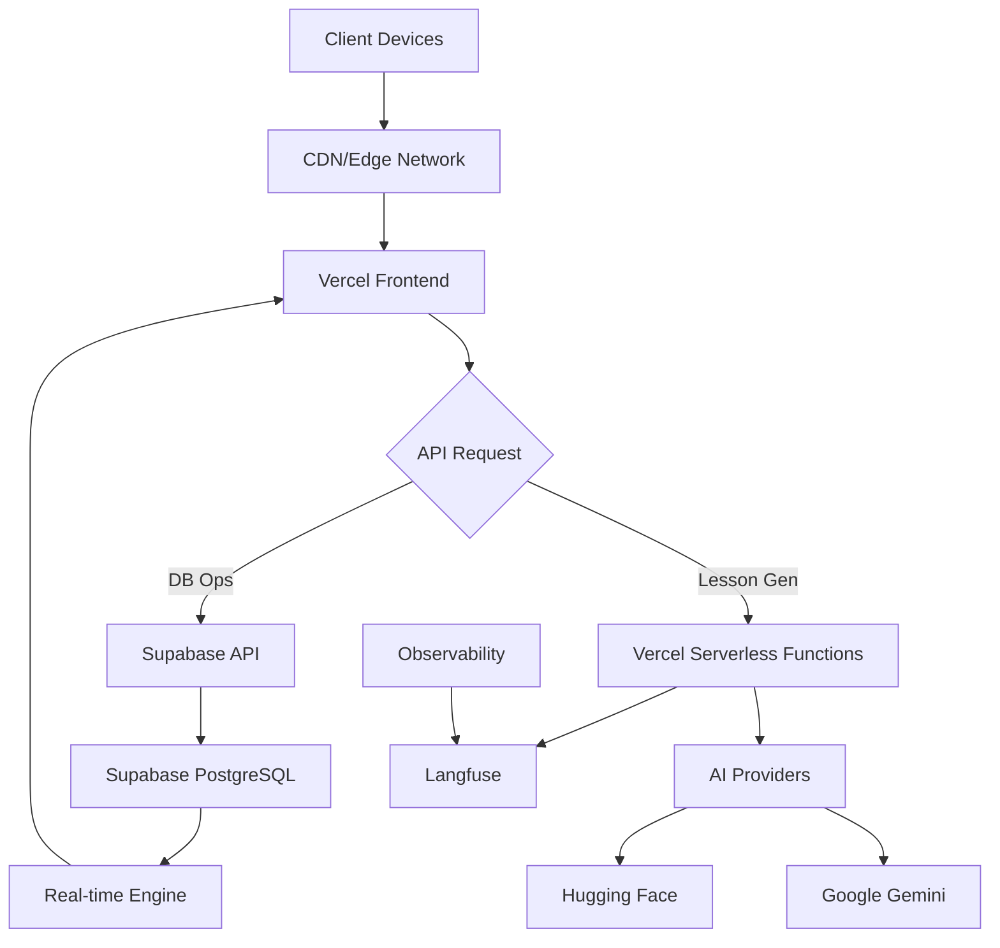

### Infrastructure Components

1. **Frontend Hosting**: Vercel for Next.js deployment
2. **API Hosting**: Vercel serverless functions
3. **Database**: Supabase PostgreSQL with real-time capabilities
4. **AI Services**: 
   - Google Gemini for text generation
   - Hugging Face for image/diagram generation
5. **Observability**: Langfuse for tracing
6. **Static Assets**: Vercel CDN for images and static files

### Scalability Considerations

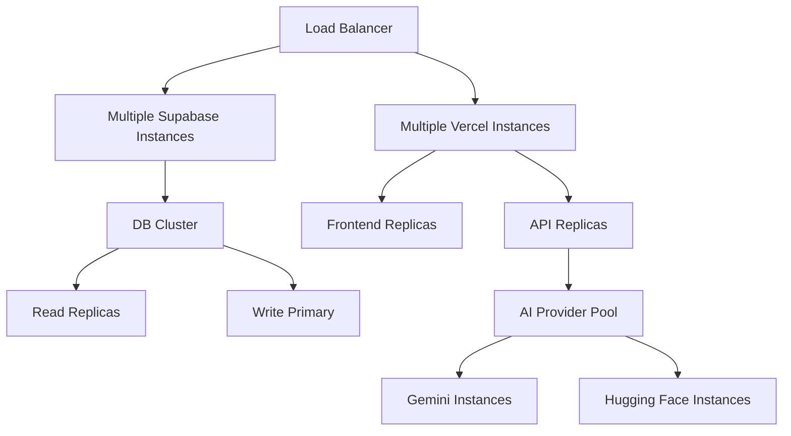

This comprehensive system design documentation provides a detailed view of the Feyra-AI platform architecture, including all requested diagrams and low-level design specifications.